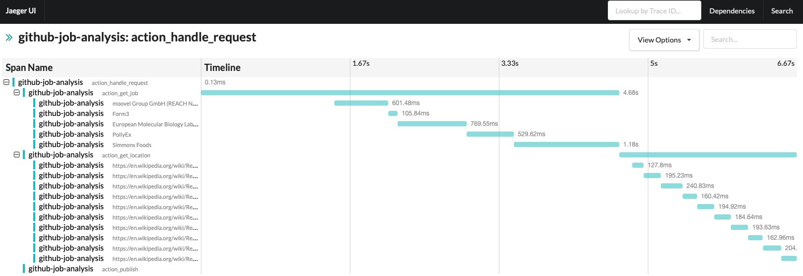

Distributed Tracing
===================

Prerequisites
--------------

Install the Jaeger platform using a Docker image. Test your deployment using the Jaeger UI: http://localhost:16686

.. code-block:: console

    $ docker run -d -p5775:5775/udp -p6831:6831/udp -p6832:6832/udp -p5778:5778 -p16686:16686 -p14268:14268 -p9411:9411 jaegertracing/all-in-one:0.8.0

Install Jaeger's implementation of OpenTracing library for Python to send traces to Jaeger's backend.
Alternatives Jaeger include Datadog or Lightstep's libraries.

.. code-block:: console

    $  pip install jaeger-client

Install an object-oriented state machine implementation to simulate the execution of a distributed application.

.. code-block:: console

    $  pip install transitions

Run the Example
---------------

.. code-block:: console

    $ python enrich_jobs_app.py

    Getting website for moovel Group GmbH (REACH NOW): http://www.moovel.com/de/DE
    Unable to get site for moovel Group GmbH (REACH NOW)
    Getting website for Form3: https://form3.tech/
    Getting website for European Molecular Biology Laboratory (EMBL): http://www.embl.org/jobs
    Getting website for PollyEx: https://www.pollyex.com/
    Getting website for Simmons Foods: http://www.workatsimmons.com
    Input to process:  [('Form3', 'Remote'), ('European Molecular Biology Laboratory (EMBL)', 'Heidelberg, Germany'), ('PollyEx', 'San Francisco, CA'), ('Simmons Foods', 'Siloam Springs')]
    Getting link: https://en.wikipedia.org/wiki/Remote
    Getting link: https://en.wikipedia.org/wiki/Remote_control
    Getting link: https://en.wikipedia.org/wiki/Remote_Desktop_Protocol
    Getting link: https://en.wikipedia.org/wiki/Remote_sensing
    Getting link: https://en.wikipedia.org/wiki/Remote_viewing
    Getting link: https://en.wikipedia.org/wiki/Remotely_operated_underwater_vehicle
    Getting link: https://en.wikipedia.org/wiki/Remote_Desktop_Services
    Getting link: https://en.wikipedia.org/wiki/Remote_control_animal
    Getting link: https://en.wikipedia.org/wiki/Remote_procedure_call
    Getting link: https://en.wikipedia.org/wiki/Remote_keyless_system

The Jaeger UI will show a trace similar to this one:

